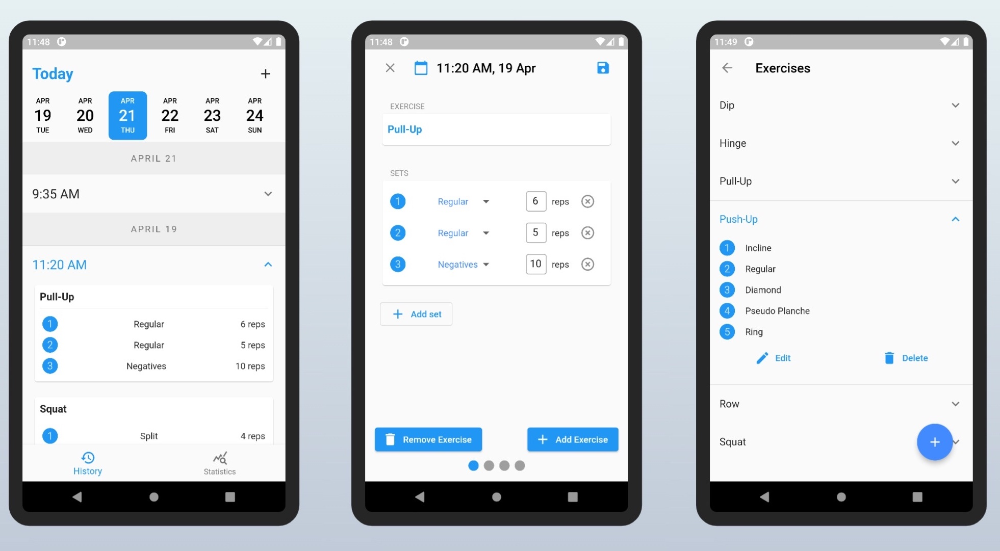

# Workout Tracker

## Description
A mobile app that helps you track the statistics from all your bodyweight workouts. Simply put in the details of your workouts and have them saved on your phone. Designed specifically for bodyweight workouts, the app allows you to create and select specific progressions for each exercise.

## Screenshots

## Built With
- Flutter
- SQLite

